# 📊 Diagramas - ZECA App

> **Visualização dos fluxos e arquitetura do aplicativo mobile.**

---

## 1. Fluxo de Abastecimento (Visão Geral)

```mermaid
flowchart TD
    subgraph App[📱 ZECA App]
        A[Login] --> B[Selecionar Veículo]
        B --> C[Buscar Posto]
        C --> D[Gerar Código]
        D --> E{Tipo Motorista}
    end

    subgraph Posto[⛽ Posto]
        F[Validar Código]
        G[Abastecer]
        H[Registrar Litros]
    end

    subgraph Pagamento[💳 Pagamento]
        I[Mostrar Resumo]
        J[Gerar QR PIX]
        K[Aguardar Pagamento]
        L[Confirmar]
    end

    E -->|Frota| F
    E -->|Autônomo| F
    F --> G --> H

    H -->|Frota| I --> M[✅ Sucesso]
    H -->|Autônomo| J --> K --> L --> M
```

---

## 2. Máquina de Estados - Abastecimento

---

## 3. Máquina de Estados - Jornada

---

## 4. Clean Architecture - Camadas

---

## 5. Fluxo de Dados - BLoC Pattern

```mermaid
flowchart LR
    subgraph UI["🖥️ UI Layer"]
        A[Widget]
    end

    subgraph BLoC["🔄 BLoC"]
        B[Event]
        C[BLoC Logic]
        D[State]
    end

    subgraph Domain["📐 Domain"]
        E[UseCase]
    end

    subgraph Data["💾 Data"]
        F[Repository]
        G[DataSource]
    end

    A -->|dispatch| B
    B --> C
    C -->|call| E
    E --> F
    F --> G
    G -->|response| F
    F -->|Either| E
    E -->|result| C
    C -->|emit| D
    D -->|rebuild| A
```

---

## 6. Fluxo de Injeção de Dependência

```mermaid
flowchart TD
    subgraph GetIt["💉 GetIt Service Locator"]
        direction TB
        G1[External Module]
        G2[DataSources]
        G3[Repositories]
        G4[UseCases]
        G5[BLoCs]
    end

    subgraph Registration["📝 Registration Order"]
        R1["1. Dio, SharedPrefs"]
        R2["2. RemoteDataSource"]
        R3["3. RepositoryImpl"]
        R4["4. UseCase"]
        R5["5. BLoC"]
    end

    G1 --> G2 --> G3 --> G4 --> G5

    R1 -.-> G1
    R2 -.-> G2
    R3 -.-> G3
    R4 -.-> G4
    R5 -.-> G5
```

---

## 7. Fluxo de Autenticação

---

## 8. Fluxo de Abastecimento (Detalhado)

```mermaid
sequenceDiagram
    participant App as 📱 App
    participant Bloc as 🔄 RefuelingBloc
    participant WS as 🔌 WebSocket
    participant API as 🌐 API
    participant Posto as ⛽ Posto

    App->>Bloc: GenerateCodeRequested
    Bloc->>API: POST /refuelings
    API-->>Bloc: { code: "ZECA2025XX", status: "PENDING" }
    Bloc-->>App: Show Code + Timer

    Note over App,Posto: Motorista mostra código para frentista

    Posto->>API: POST /refuelings/{code}/validate
    API->>WS: emit("refueling_validated")
    WS-->>Bloc: RefuelingValidated
    Bloc-->>App: Update Status

    Posto->>API: POST /refuelings/{code}/complete
    API->>WS: emit("refueling_completed")
    WS-->>Bloc: RefuelingCompleted

    alt Motorista Frota
        Bloc-->>App: Show Success + Summary
    else Motorista Autônomo
        Bloc-->>App: Show PIX QR Code
        App->>API: Polling /payments/{id}/status
        API-->>App: { status: "COMPLETED" }
        App-->>App: Show Success
    end
```

---

## 9. Estrutura de Feature

```mermaid
flowchart TD
    subgraph Feature["📁 features/refueling/"]
        subgraph Data["data/"]
            D1["datasources/<br/>refueling_remote_datasource.dart"]
            D2["models/<br/>refueling_model.dart"]
            D3["repositories/<br/>refueling_repository_impl.dart"]
        end

        subgraph Domain["domain/"]
            DO1["entities/<br/>refueling.dart"]
            DO2["repositories/<br/>refueling_repository.dart"]
            DO3["usecases/<br/>get_refuelings_usecase.dart"]
        end

        subgraph Presentation["presentation/"]
            P1["bloc/<br/>refueling_bloc.dart"]
            P2["pages/<br/>refueling_page.dart"]
            P3["widgets/<br/>refueling_card.dart"]
        end
    end

    D1 --> D3
    D2 --> D3
    D3 -.->|implements| DO2
    DO3 --> DO2
    DO3 --> DO1
    P1 --> DO3
    P2 --> P1
    P3 --> P2
```

---

## 10. Navegação do App

---

## 11. WebSocket Events

```mermaid
flowchart LR
    subgraph Backend["🌐 Backend"]
        B1[API]
        B2[WebSocket Server]
    end

    subgraph App["📱 App"]
        A1[WebSocketService]
        A2[RefuelingBloc]
        A3[JourneyBloc]
        A4[NotificationBloc]
    end

    B1 --> B2
    B2 -->|refueling_validated| A1
    B2 -->|refueling_completed| A1
    B2 -->|payment_confirmed| A1
    B2 -->|journey_alert| A1

    A1 --> A2
    A1 --> A3
    A1 --> A4
```

---

## 12. Hierarquia de Estados UI

```mermaid
flowchart TD
    subgraph States["📊 UI States"]
        S1[Initial]
        S2[Loading]
        S3[Loaded]
        S4[Empty]
        S5[Error]
        S6[Refreshing]
    end

    S1 -->|LoadRequested| S2
    S2 -->|Success + Data| S3
    S2 -->|Success + Empty| S4
    S2 -->|Failure| S5
    S3 -->|RefreshRequested| S6
    S4 -->|RefreshRequested| S6
    S5 -->|RetryRequested| S2
    S6 -->|Success| S3
    S6 -->|Failure| S5
```

---

## Como Usar os Diagramas

### No VS Code

1. Instalar extensão "Markdown Preview Mermaid Support"
2. Abrir este arquivo
3. Ctrl+Shift+V para preview

### No GitHub

Os diagramas renderizam automaticamente no GitHub.

### Exportar como Imagem

1. Acesse [mermaid.live](https://mermaid.live)
2. Cole o código do diagrama
3. Exporte como PNG/SVG

---

*Diagramas v2.0.0 - Janeiro 2026*
