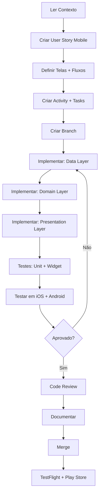

# 📱 .cursor/ - Documentação e Contexto do ZECA App (Flutter)

Esta pasta contém toda a documentação estruturada, decisões técnicas, padrões e contexto para auxiliar no desenvolvimento e manutenção do app mobile ZECA.

---

## 📁 Estrutura de Pastas

```
.cursor/
├── config/              # Configurações do Cursor AI e ferramentas
├── prompts/             # Prompts reutilizáveis para AI
├── docs/                # Documentação técnica
│   ├── architecture/    # Arquitetura do app Flutter
│   ├── patterns/        # Padrões de código Flutter/Dart
│   ├── decisions/       # Architecture Decision Records (ADRs)
│   ├── user-stories/    # Histórias de usuário
│   └── specifications/  # Especificações técnicas detalhadas
└── activities/          # Activities (implementações de user stories)
    └── UH-XXX-nome/     # Uma pasta por user story
        ├── README.md    # User story detalhada
        ├── planning.md  # Planejamento técnico
        ├── tasks/       # Tasks individuais
        └── progress.json # Progresso da implementação
```

---

## 🎯 Objetivo

**Garantir contexto persistente e consistência no desenvolvimento mobile:**

1. ✅ **Documentação sempre atualizada** para Flutter/Dart
2. ✅ **Decisões técnicas registradas** (ADRs sobre Flutter, packages, etc)
3. ✅ **Padrões de código claros** para Clean Architecture + BLoC
4. ✅ **Histórico completo** de features implementadas
5. ✅ **AI sempre contextualizada** sobre o app mobile
6. ✅ **Integração documentada** com backend (zeca_site)

---

## 🚀 Como Usar

### **Para iniciar uma nova funcionalidade mobile:**

1. **Ler contexto:**
   - Arquitetura: `.cursor/docs/architecture/`
   - Padrões Flutter: `.cursor/docs/patterns/`
   - Decisões: `.cursor/docs/decisions/`
   - Especificações: `.cursor/docs/specifications/`

2. **Criar User Story:**
   - Escrever em `.cursor/docs/user-stories/UH-XXX-titulo.md`
   - Definir telas, fluxos mobile
   - Critérios de aceite (iOS + Android)

3. **Criar Activity:**
   - Pasta `.cursor/activities/UH-XXX-titulo/`
   - Quebrar em tasks (feature → data/domain/presentation)
   - Criar `planning.md`
   - Inicializar `progress.json`

4. **Implementar:**
   - Criar branch `feature/UH-XXX-titulo`
   - Seguir Clean Architecture
   - Implementar por camadas (data → domain → presentation)
   - Testar em iOS + Android

5. **Finalizar:**
   - Code review
   - Testes (unit + widget + integration)
   - Documentar lições aprendidas
   - Atualizar ADRs
   - Merge para `main`
   - Deploy TestFlight + Play Store Internal

---

## 📖 Documentos Principais

| Documento | Descrição | Caminho |
|-----------|-----------|---------|
| **Guia de Desenvolvimento Flutter** | Step-by-step completo | `.cursor/docs/patterns/development-guide-flutter.md` |
| **Arquitetura Mobile** | Clean Architecture + BLoC | `.cursor/docs/architecture/README.md` |
| **Padrões de Código Dart** | Convenções Dart/Flutter | `.cursor/docs/patterns/coding-standards-flutter.md` |
| **Padrões de UI/UX Mobile** | Design system, responsividade | `.cursor/docs/patterns/ui-ux-mobile-standards.md` |
| **Estratégia de Testes** | Unit, Widget, Integration | `.cursor/docs/patterns/testing-strategy-flutter.md` |
| **Integração Backend** | APIs, autenticação, sync | `.cursor/docs/patterns/backend-integration.md` |
| **ADRs** | Decisões técnicas | `.cursor/docs/decisions/` |
| **Especificações** | Features detalhadas | `.cursor/docs/specifications/` |

---

## 🔄 Workflow Mobile Recomendado



---

## 📝 Convenções Mobile

### **Nomenclatura:**
- User Stories: `UH-XXX-titulo-kebab-case` (UH = User History)
- Features: `lib/features/nome_feature/`
- Branches: `feature/UH-XXX-titulo` ou `bugfix/descricao`
- Telas: `nome_page.dart`
- Widgets: `nome_widget.dart`
- BLoCs: `nome_bloc.dart`, `nome_event.dart`, `nome_state.dart`

### **Estrutura de Feature (Clean Architecture):**
```
lib/features/nome_feature/
├── data/
│   ├── datasources/
│   ├── models/
│   └── repositories/
├── domain/
│   ├── entities/
│   ├── repositories/
│   └── usecases/
└── presentation/
    ├── bloc/
    ├── pages/
    └── widgets/
```

### **Status:**
- `pending`: Não iniciado
- `in_progress`: Em desenvolvimento
- `testing`: Em testes (iOS + Android)
- `completed`: Concluído (deployed)
- `cancelled`: Cancelado

### **Commits:**
- `feat: descrição` - Nova funcionalidade
- `fix: descrição` - Correção de bug
- `docs: descrição` - Apenas documentação
- `refactor: descrição` - Refatoração
- `test: descrição` - Testes
- `chore: descrição` - Manutenção/configuração
- `build: descrição` - Build configs (pubspec, Xcode, Gradle)

---

## 🤝 Contribuindo

1. **Sempre** ler o contexto Flutter antes de começar
2. **Sempre** seguir Clean Architecture + BLoC
3. **Sempre** testar em iOS E Android
4. **Sempre** documentar decisões sobre packages (ADRs)
5. **Sempre** atualizar especificações
6. **Sempre** validar integração com backend

---

## 🛠️ Stack Tecnológico

### **Framework & Linguagem:**
- Flutter 3.x
- Dart 3.x

### **Arquitetura:**
- Clean Architecture
- BLoC Pattern (flutter_bloc)
- Dependency Injection (get_it + injectable)

### **Principais Packages:**
- **State**: flutter_bloc, equatable
- **Network**: dio, retrofit
- **Storage**: hive, shared_preferences, flutter_secure_storage
- **Navigation**: go_router
- **Location**: flutter_background_geolocation, geolocator
- **Maps**: google_maps_flutter
- **Camera/OCR**: camera, google_mlkit_text_recognition
- **Push**: firebase_messaging
- **QR**: mobile_scanner, qr_flutter

### **Features Principais:**
- 🔐 **Autenticação** (JWT, CPF)
- 🚗 **Abastecimento** (QR code, validação, polling)
- 🗺️ **Jornadas** (tracking GPS, navegação)
- 📸 **Odômetro** (OCR com ML Kit)
- 🔔 **Notificações** (Push Firebase)
- ✅ **Checklist** (Veículos)
- 🏷️ **White-label** (Multi-brand)

---

## 📱 Plataformas Suportadas

- **iOS**: 13.0+
- **Android**: API 21+ (Android 5.0 Lollipop)

---

## 📞 Contato

Para dúvidas sobre a estrutura ou processo mobile:
- Projeto: ZECA - Sistema de Abastecimento Inteligente
- Repositório: zeca_app
- Backend: zeca_site
- Documentação Backend: `../zeca_site/.cursor/`

---

**Criado em:** 27/11/2025  
**Versão:** 1.0.0  
**Status:** ✅ Ativo

